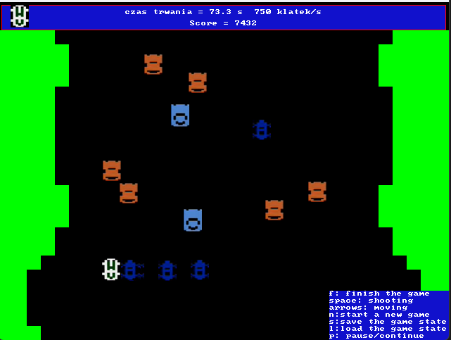
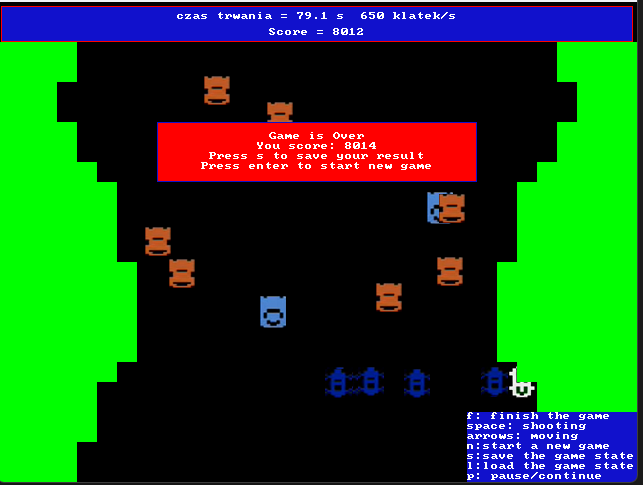

# Study project
## Spy Hunter

A learning project whose goal is to write an application analog of the game Spy Hunter. You can read about the original version [here](https://en.wikipedia.org/wiki/Spy_Hunter). SDL graphics library is used for interface rendering.

## Rules

The goal of the game is to survive as long as possible and gain points. The player has 3 lives at the beginning of the game, which are not consumed during the first 60 seconds. Additional points are awarded for killing enemies. You can kill cars in 2 ways (push them off the road, shoot them with a gun). There are 2 types of enemies:
* Passive (do not interfere with the player)
* Active (try to push the player out of the way)

Also on the track there are cars-allies, for killing which the player's points is frozen for some time.

## Controls

A hint for the control buttons is shown in the lower right corner. Also during the game appear additional hints with keys that work only in that place.

The basic control buttons can be found below

| Key | Action
| :-----: | -----
| <kbd>Space</kbd> | Fire a shot
| <kbd>P</kbd> | Pause/Resume game
| <kbd>F</kbd> | Finish the game
| <kbd>N</kbd> | Start new game
| <kbd>S</kbd> | Save current state to file
| <kbd>L</kbd> | Load current state from file
| <kbd>Arrows</kbd> | Move around the road

## Launching

The application is written for the Window platform and requires Visual Studio to run. To start it you need to open the project file `szablon2vs19.sln` with Visual Studio and start the project build.

## Technical features

The SDL library and bmp graphics are used to render the interface. The application allows you to save the game state to a file and then restore it. For this purpose the application reads save files from directories and shows their names for selection.

The application stores a road pattern in the `road.txt` file and repeats this pattern cyclically. 

It also prompts the player to save his result after completing the game. If the user accepts, his current result is saved in the file. And the pause menu shows the best results for the whole time sorted by time or points (by default).

## Screenshots
### Screenshot during the game

### Game over menu

